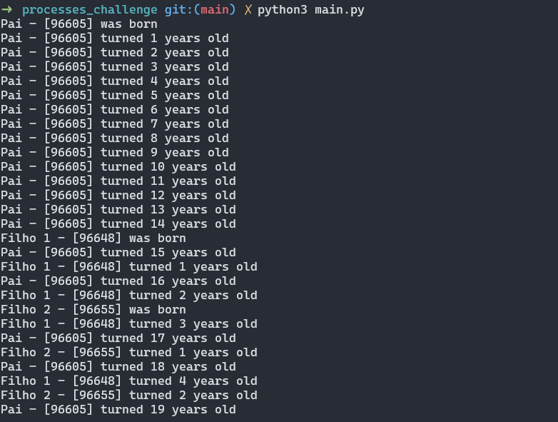
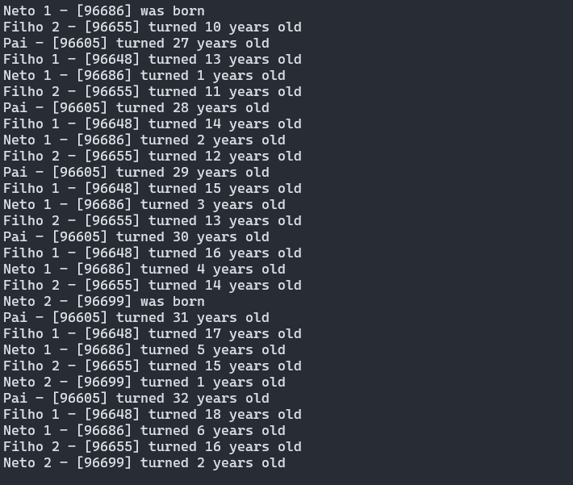
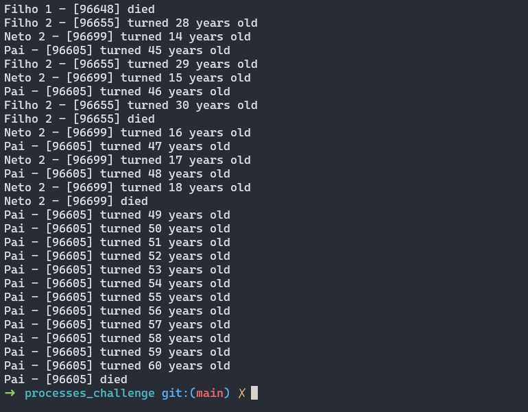
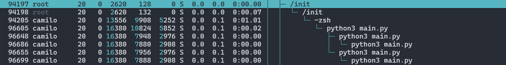

# PROCESS CHALLENGE

The challenge aims to create an algorithm responsible for simulating the creation and death of processes in a family structure, that is, simulating a family of processes, where there are parent processes and child processes.

## Objective

The objective is to simulate the family hierarchy of processes, following the structure below, where the parent has children and grandchildren with specific lifetimes. The processes must be created in a chronological sequence, and the program needs to simulate the lifetime of each one. Each year of life will be represented by one second.

### Simulation Rules

- 1 second equals 1 year of life in the simulation.
- The parent:
  - Dies at <b>60 years</b>.
  - Has the <b>first child at 14 years</b>.
  - Has the <b>second child at 16 years</b>.
  - Becomes a <b>grandparent of the first grandchild at 26 years</b> (first child).
  - Becomes a <b>grandparent of the second grandchild at 30 years</b> (second child).
- The children:
  - Both children of the parent die at <b>30 years</b>.
- The grandchildren:
  - The <b>first grandchild</b> dies at <b>12 years</b>.
  - The <b>second grandchild</b> dies at <b>18 years</b>.

## Implementation

The algorithm was implemented in Python, and the simulation was based on the rules above. The code has a class called `Person` that represents a process (or person) and has the following attributes:
- `name`: Name of the process.
- `maxAge`: Maximum age the process can live.
- `birth`: When the process was created.
- `children`: List of children of the process.

Additionally, there is a function `process` that takes as parameters an object of type `Person` and the elapsed time in the simulation, called `current_time`. The function is responsible for creating all the processes and simulating the life of each one from birth to death, including the creation of children and grandchildren.

## Results

The simulation was executed, and the results were printed on the console. The output shows the creation of each process and the time of death. The simulation was executed for 60 years, and the results were as expected, following the rules defined in the challenge.

## Simulation Output

Below are the images showing the simulation output:

### HTOP

## Conclusion

The challenge was successfully implemented, and the simulation was executed as expected. The algorithm created the processes following the family hierarchy and simulated the lifetime of each one, considering the rules defined in the challenge. The code is available in the file `main.py`.